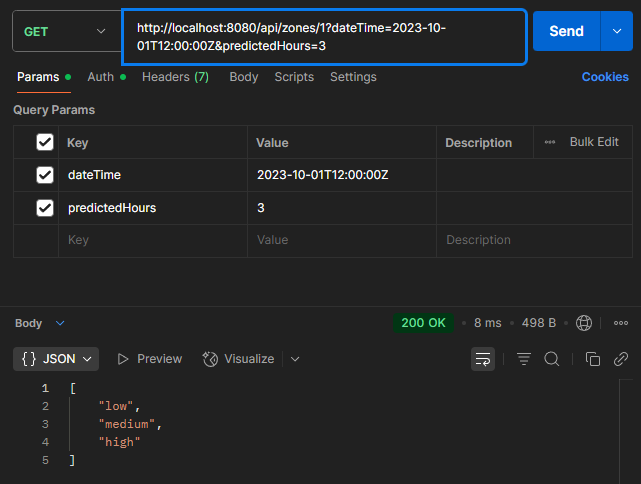
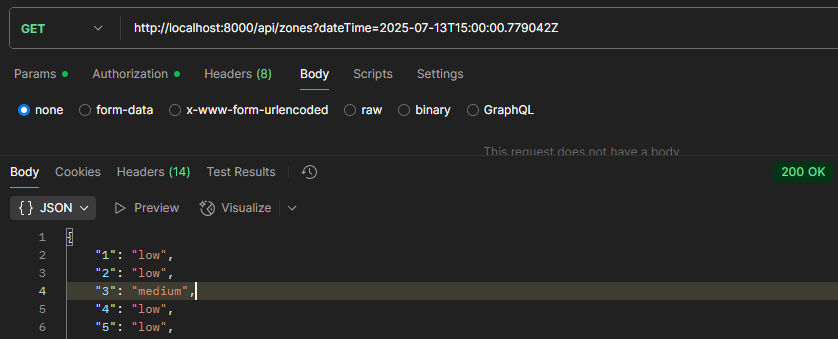
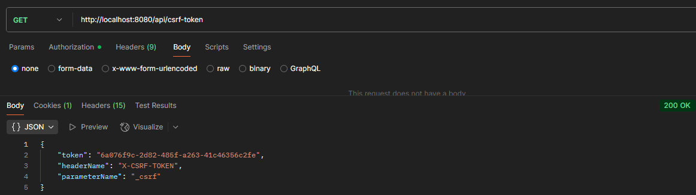
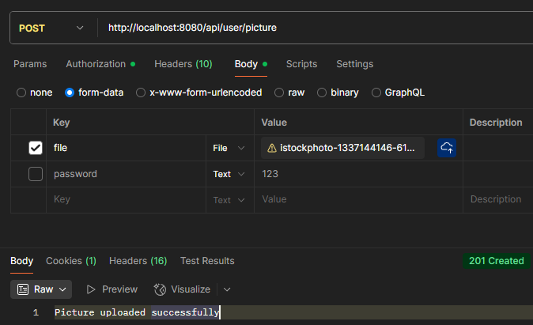
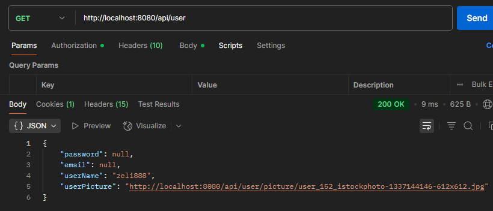
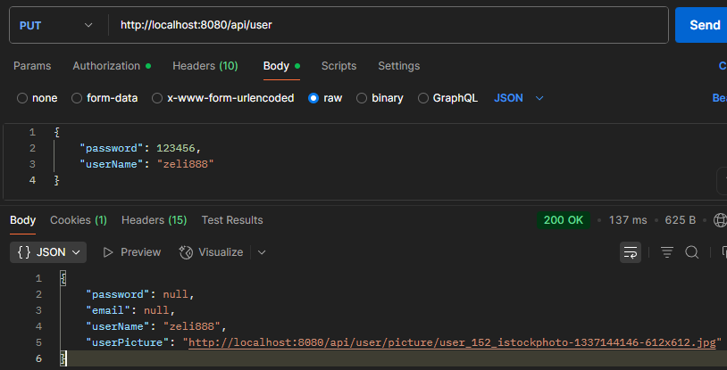
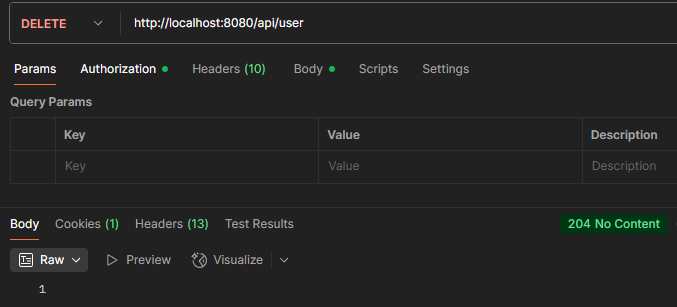
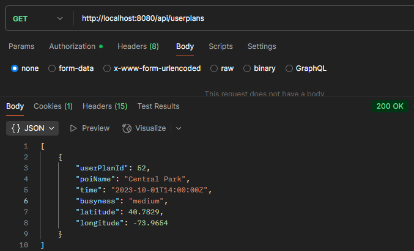
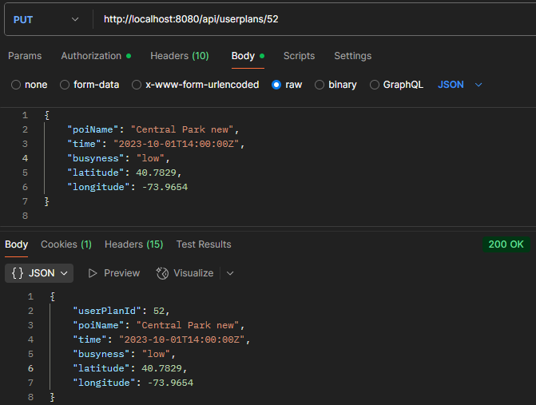

### Swagger example API call
- local: http://localhost:8080/api/swagger-ui/index.html
- remote: https://planhattan.ddns.net/api/swagger-ui/index.html
---------------
### Example API with Postman
#### poi list & zone busyness
- query params & poi list:

- zone busyness:

#### Recommendation API:
- POST Request
- fixed location should contain latitude, longitude, poiName, zoneId, time, transitType (optional) 
- uncertain location should contain poiTypeName, time, transitType (optional) 
- the first location should be fixed start location without transitType

#### POI Type API:

#### Zone busyness API:
- predict one zone's busyness for continuous predictedHours after a specific time

#### All Zone busyness API:
- predict all zones' busyness for a specific time

#### Weather API:
- check https://openweathermap.org/api/one-call-3 for details

#### Register API:
- userName and password are necessary.
- userPicture will be ignored, should be updated after registration.
- email will be linked automatically when user login through third-party account.

#### Login API:
- has to be form login

#### CSRF Token API:
- has to login first
- then get the csrf token

- then add the token to the header with ```X-CSRF-TOKEN:{token}``` for following requests that need authentication.


#### Update User Picture API:
- has to login first & set the csrf token in header
- file size limit is 5MB
- file type should be image/jpeg, image/png, image/gif

#### Get User Picture API:
- don't need login, userPicture is public.

#### Get User Details API:
- has to login first & set the csrf token in header
- you can use ``````  directly in html to display the picture

#### Update User Details API:
- has to login first & set the csrf token in header
- we don't offer email update service, it will link to third-party account automatically
- userPicture will be ignored, should be updated by posting.

#### Logout API:
- has to login first & set the csrf token in header

#### Delete User API:
- has to login first & set the csrf token in header

#### Add User Plan API:
- has to login first & set the csrf token in header

#### Add Multiple User Plan API:
- has to login first & set the csrf token in header

#### Get User Plan API:
- has to login first & set the csrf token in header

#### Update User Plan API:
- has to login first & set the csrf token in header

#### Delete User Plan API:
- has to login first & set the csrf token in header

#### Delete Multiple User Plan API:
- has to login first & set the csrf token in header
