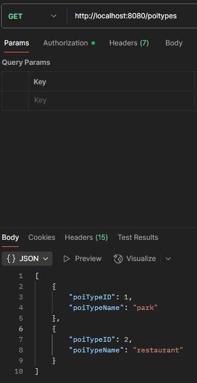
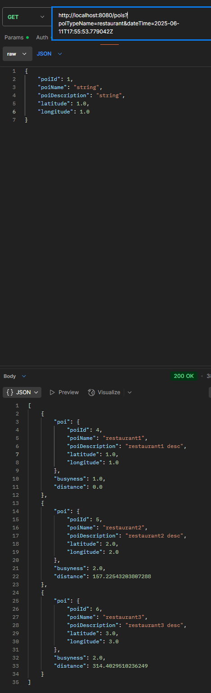
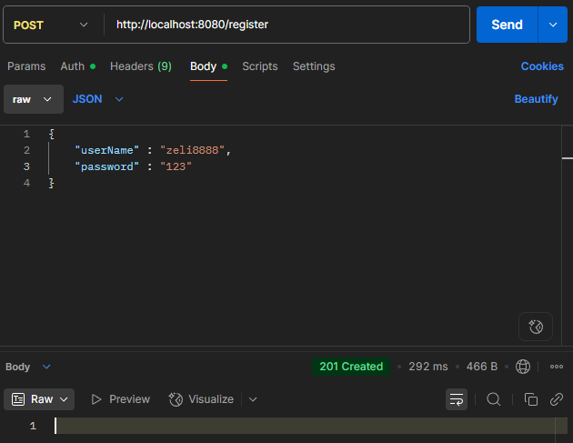
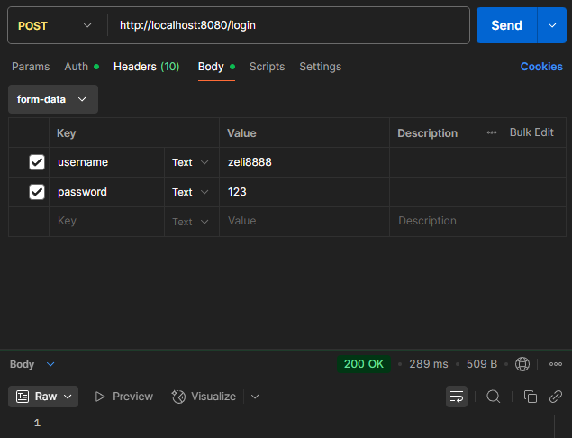
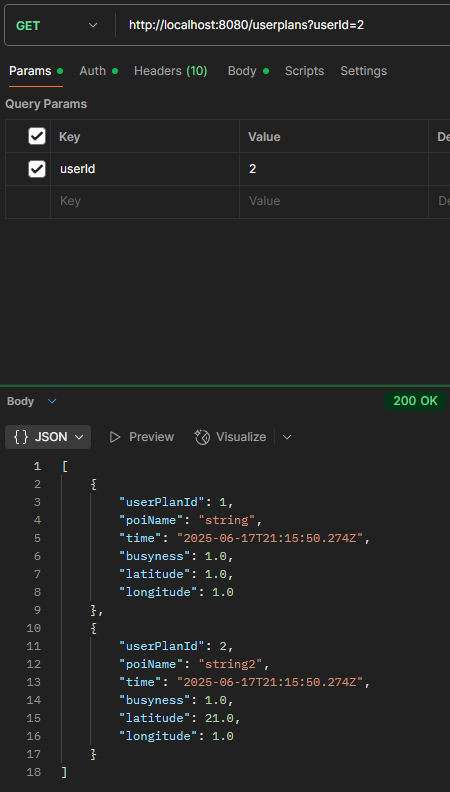
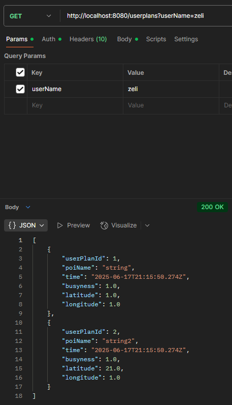
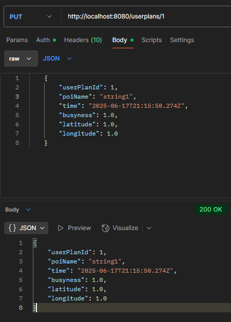
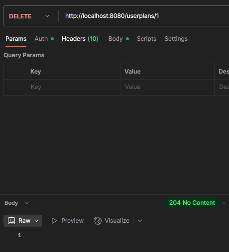

## This is a Spring Boot application with maven as dependency manager
----------------------
#### Please check database setting in 
- src/main/resources/application.properties.

#### The default database name for this application is comp47360
--------------------
### To start the application in development mode, please run
- mvn clean package
- mvn spring-boot:run
-------------------------
### Check API by starting this application and open
### http://localhost:8080/swagger-ui/index.html
---------------
### Example API with Postman

#### user plan api needs to be authenticated, user has to log in first and cannot access other users' plan

### Login api is POST request to http://localhost:8080/login 

### with form data: 

- #### **"username"** as key, **username or email** as value 

- #### **"password"** as key, password as value
---------------------
### Testing
- Please check the testing folder src/test/java/team8/comp47360_team8_backend
- For unit testing, there are test cases for controller, service
- If you want to contribute, please create a new branch and push to github. After you finish, please message me to avoid duplicate work.
- I have done POIControllerTest and ZoneServiceTest, you can check them for reference.
- We will implement integration testing in the future.
- This is not mandatory, so only do it when you have free time.