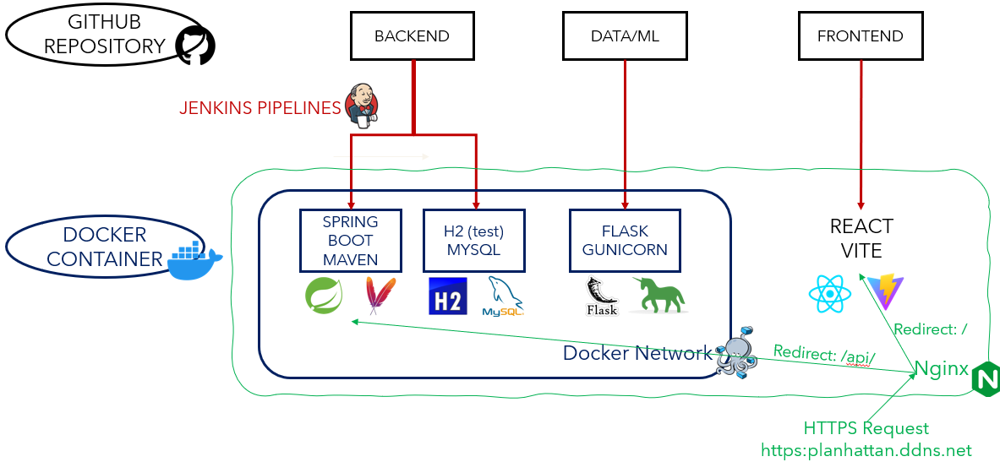

# 🛞 Planhattan Backend API

**[Planhattan](https://planhattan.ddns.net)** is a responsive web application designed to helps tourists plan their day by predicting and visualising crowd data for popular attractions, restaurants, parks, and museums. 🎉

**Frontend Repository**: https://github.com/RaghulPrasath-Here/PlanHattan-FrontEnd.git
**Machine Learning Model Repository**: https://github.com/Always228474/COMP47360_Team8_Data.git



---

## 📋 Table of Contents
- [✨ Features](#-features)
- [🚀 Getting Started](#-getting-started)
  - [⚙️ Configuration](#️-configuration)
  - [🔧 Installation](#-installation)
- [💻 Usage](#-usage)
- [🐛 Common Bugs](#-common-bugs)
- [📂 Project Structure](#-project-structure)
- [🤝 Contributing](#-contributing)
- [📝 License](#-license)
- [📧 Contact](#-contact)

---

## ✨ Features
- **POI Recommendation System👍**
    - leverages machine learning models to predict the busyness of different zones in New York City. 
    - handles requests for supported POI categories
    - utilizes two recommendation algorithms to suggest optimal POIs based on user input.
        - provides top-k recommended POIs at each stage of the itinerary planning process, enabling users to make informed decisions throughout the planning.
        - generates a comprehensive daily travel plan tailored to the user’s preferences.
        - Both recommendation algorithms consider predicted busyness and distance to offer reasonable and practical suggestions.

- **User Management System🪪**
    - responsible for managing user information and maintaining a record of users’ historical travel plans.
    - supports two login methods:
        - Traditional form login, where passwords are securely encoded using the bcrypt algorithm.
        - Google login, which implements the standard OAuth 2.0 workflow to ensure enhanced security.
        - Session management is utilized to maintain the user’s login state for both methods.

- **Security Measures🔐**
    - A strict CORS (Cross-Origin Resource Sharing) policy is applied to restrict AJAX requests to requests originating from the front-end domain.
    - The Spring Boot Security chain is employed to enforce authentication for all endpoints that require user login.
    - CSRF (Cross-Site Request Forgery) tokens are included for all potentially risky endpoints to safeguard user sessions.

- **Complete Test Cases🧑‍🔬**
    - Unit Testing for all controllers and services
    - Integration Test for authentication and security
    - Load Test using JMeter on UCD College offered server
        - CPU: QEMU Virtual CPU version 2.5+, 2 cores, 2GHz, 64 bits
        - Memory: 4GB
        - Storage: 32GB
---

## 🚀 Getting Started

### ⚙️ Configuration
- Check [application.properties](src/main/resources/application.properties) for application configuration.
- Check [mysql.yaml](mysql.yaml) for mysql database configuration.
- Check [planhattan-api.yaml](planhattan-api.yaml) for deploy configuration
- To configure the project, set the following environment variables first:

    ```env
    PLANHATTAN_MYSQL_URL=your_mysql_database_url
    MYSQL_PASSWORD=your_mysql_password
    PLANHATTAN_MYSQL_VOLUME=your_expected_mysql_container_volume_url
    PLANHATTAN_ML_URL=your_machine_learning_model_container_url
    PLANHATTAN_UPLOADS=your_expected_container_volume_url_for_user_upload_files
    GOOGLE_OAUTH2_CLIENT_ID=your_Google_client_Id
    GOOGLE_OAUTH2_CLIENT_SECRET=your_Google_client_password
    OPEN_WEATHER_KEY=your_open_weather_key
    ```

### 🔧 Installation
To get started with **Planhattan Backend API**, follow these steps:

1. Clone the repository:
   ```bash
   git clone https://github.com/zeli8888/COMP47360_Team8_Backend.git
   ```

2. Navigate to the project directory:
   ```bash
   cd COMP47360_Team8_Backend
   ```

3. Install dependencies and run test (make sure Maven is correctly configured):
   ```bash
   mvn test
   ```
   optional: check the test report with Jacoco:
   ```bash
   mvn test jacoco:report
   ```
   report will be generated at
   ```bash
   /target/site/jacoco/index.html
   ```


---

## 💻 Usage
Here’s how to deploy **Planhattan Backend API**:

1. fork this github repository:

2. replace zeli8888 in [Jenkinsfile](Jenkinsfile) and [planhattan-api.yaml](planhattan-api.yaml) to your docker account:

3. deploy jenkins pipeline with your forked github repository

Or Simply use my docker image (can't customize)

1. pull backend docker image
```bash
docker pull zeli8888/planhattan-api:{version_you_like}
```
2. run mysql container
```bash
docker-compose -p planhattan -f mysql.yaml up -d --force-recreate
```
3. run backend docker container
```bash
export version=${version_you_like} && docker-compose -p planhattan -f planhattan-api.yaml up -d --force-recreate
```

4. initial data load (Only required once, please install required python packages, or manually load data from [poitype_data.csv](data/poitype_data.csv), [zone_data.csv](data/zone_data.csv) and [poi_data.csv](data/poi_data.csv))
```bash
cd data
python load_data.py
```

5. Access the application at `http://127.0.0.1:8000`.

6. Configure Nginx for outer access (HTTPS is necessary).

---

## 📂 Project Structure
- deploy files: 
    - [mysql.yaml](mysql.yaml) for mysql database configuration.
    - [planhattan-api.yaml](planhattan-api.yaml) for backend deploy configuration
    - [Jenkinsfile](Jenkinsfile) for jenkins deploy stage configuration
- data: database data
- docs: example api calls with Postman, check [api_example.md](docs/api_example.md)
- JMeter: load test results
- Jacoco: unit/integration test results, check [index.html](jacoco/index.html)
- uploads: directory for user to upload profile image
- src: follow a typical Spring MVC (Model-View-Controller) pattern.
---

## 🤝 Contributing
We welcome contributions! 🎉 If you'd like to contribute, please follow these steps:

1. Fork the repository.

2. Create a new branch:
   ```bash
   git checkout -b feature/your-feature-name
   ```

3. Commit your changes:
   ```bash
   git commit -m "Add your awesome feature"
   ```

4. Push to the branch:
   ```bash
   git push origin feature/your-feature-name
   ```

5. Open a pull request. 🚀

---

## 📝 License
This project is licensed under the **MIT License**. See the [LICENSE](LICENSE) file for details. 🐜

---

## 📧 Contact
If you have any questions or feedback, feel free to reach out:

- **Email**: zeli8888@outlook.com 📩
- **GitHub Issues**: [Open an Issue](https://github.com/zeli8888/BikeShareApp/issues) 🐛

---

Made with ❤️ by [Ze Li](https://github.com/zeli8888). Happy coding! 🎉